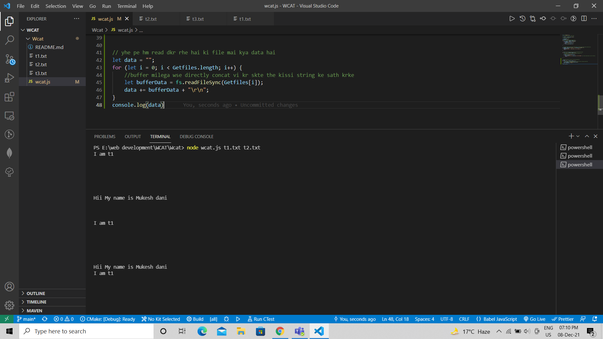
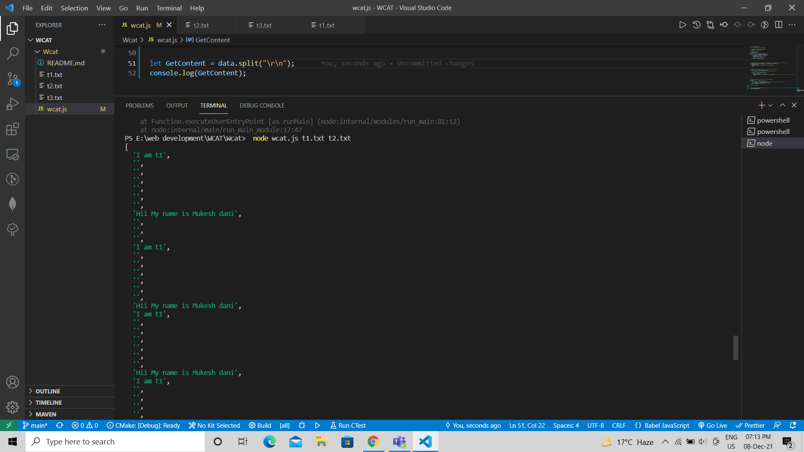
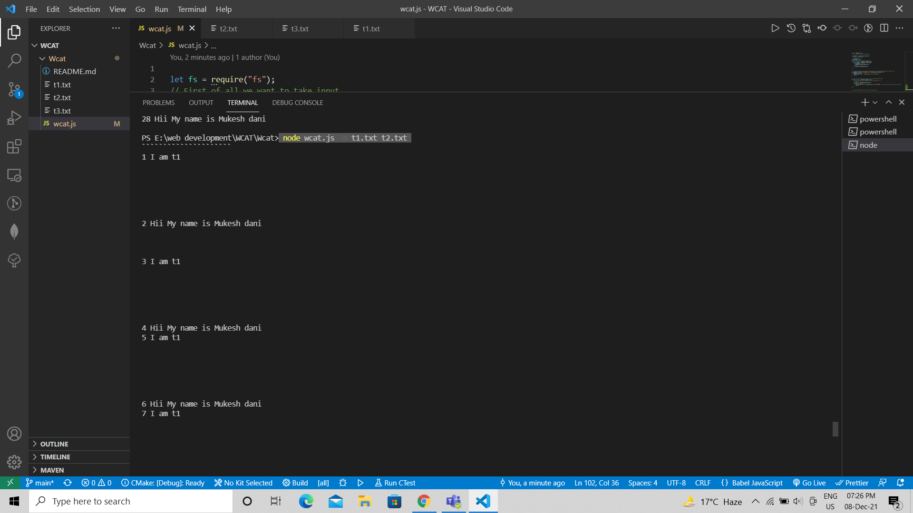
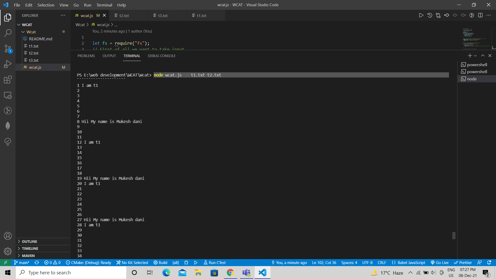
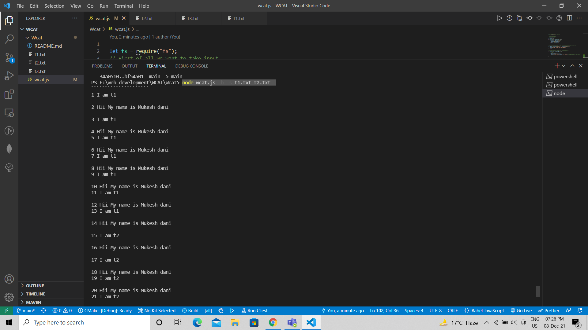
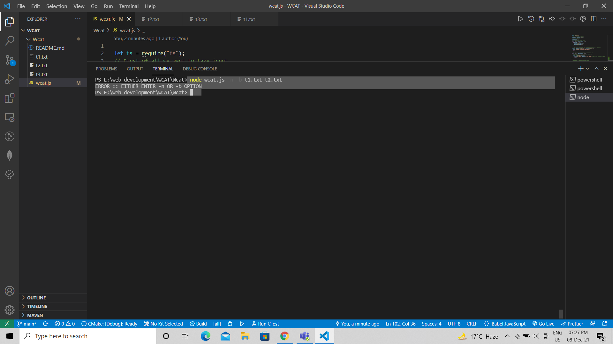
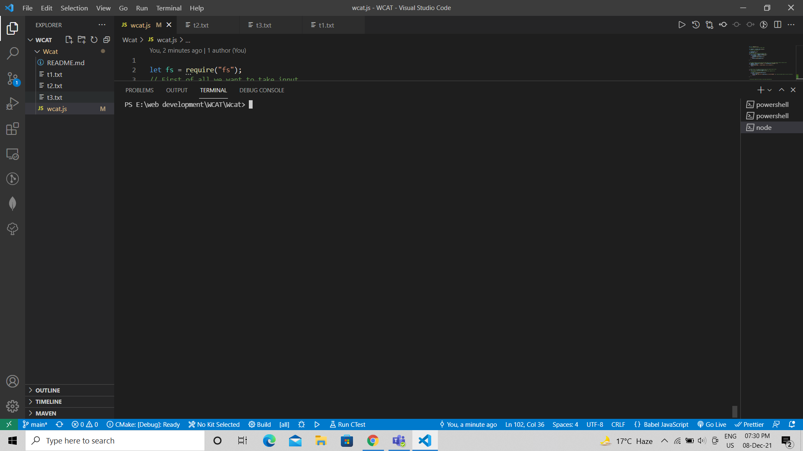
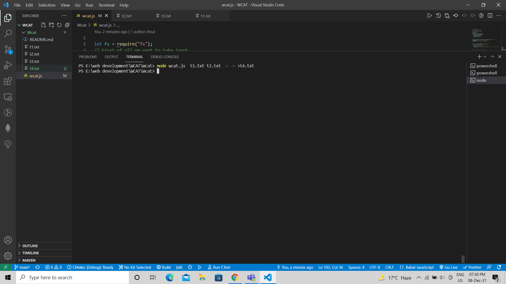

<h1 align="center">Wcat 🚀🚀 💥</h1>

**[Web Development 👉](https://github.com/mukeshdani/Dev)** *Using-JavaScript and Node js*

<!--  -->

# Wcat 🚀🚀 

It is used to display or make a copy content of one or more files in ~~the~~ terminal 

## Commands:
* 1- wcat filepath => displays content of the file in the terminal 

* 2- wcat filepath1 filepath2 filepath3... => displays content of all files in the terminal(contactinated form) in the given order. 

* 3- wcat -s filepath => convert big line breaks into a singular line break 

* 4- wcat -n filepath => give numbering to all the lines  

* 5- wcat -b filepath => give numbering to non-empty lines  

* 6- wcat filepath > filename2path => put all the content of filename into filename2 by overriding and also creates ~~filename2~~ if it doesn't exist. 

* 7- wcat filename2path >> filename2path => append all the content of filename into ~~filename2~~

* 8- node wcat -s filename > filename2 =>get the file content of filename remove large spaces and save the output in filename2 

* We can mix and match the options.

## Edge cases:

* 1- If file entered is not found then it gives file does not exist error.

* 2- **-n**  and **-b** are 2 options available together then command should give you an ~~error~~

# Results 

*  

 * 

  
# using -b cammand

*   

# using -n cammand 
* 

# using  -b -s cammand 
* 

# using -n -b cammand 
* 

# node inbuild cammands

* 

* 

## Technology 👇
-JavaScript 

-Node.js

-Git Hub 
 ## Platform 👇

-[Pepcoding](https://www.pepcoding.com/)

-[Nados](https://nados.pepcoding.com/)

-[Leetcode](https://leetcode.com/)

-[Visual Studio code editor](https://code.visualstudio.com/)

### contact 
💼 Pull requests help you collaborate on code with me [issues and pull requests](https://github.com/mukeshdani/Wcat-/pulls) :)

 💼 if you have any doubt? do reach, [email](mailto:mukeshdani00@gmail.com) :)
